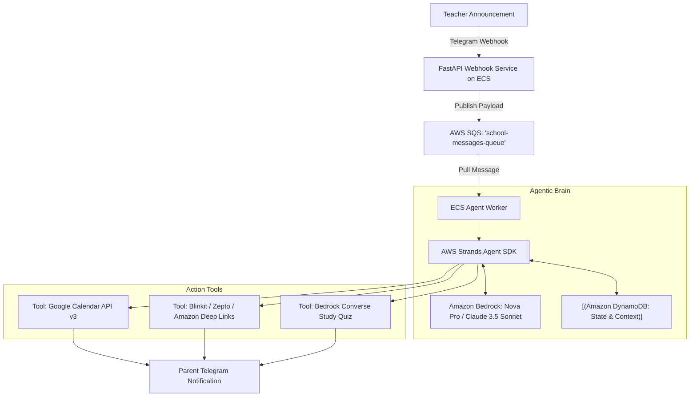

# Parent Co-pilot (Strands Agent SDK on AWS)

Educational & Administrative Co-pilot for parents, refactored with the **AWS Strands Agent SDK** (`strands-agents`) and running on **Amazon Web Services (AWS)** using **Amazon Bedrock**, **Amazon DynamoDB**, and **AWS SQS**.

---

## Architecture Overview



### Components
- **Strands Agent Core (`services/agent/strands_agent.py`):** Uses AWS Strands SDK with Amazon Bedrock to extract action items, deadlines, and materials from unstructured teacher messages.
- **Ingestion Service (`services/ingestion/aws_main.py`):** FastAPI app (AWS Lambda / App Runner) that receives Telegram webhooks and pushes messages to AWS SQS.
- **SQS Queue (`parent-copilot-messages-queue`):** Asynchronously queues inbound messages for the Strands agent worker.
- **State Store (`Amazon DynamoDB`):** Persistent table `ParentCopilotState` storing extracted tasks, summaries, and tool outputs per user.
- **Tools (`services/agent/strands_agent.py`):**
  - `schedule_calendar_event`: Automatically creates Google Calendar invites.
  - `search_materials`: Finds e-commerce search links for required school supplies.

---

## Quick Start & Local Verification

### 1. Install Dependencies
```bash
pip install -r services/agent/requirements.txt
```

### 2. Run Local Verification Test
```bash
python services/agent/test_local_strands.py
```

---

## Deploying to AWS

### Prerequisites
- AWS CLI configured (`aws configure`)
- Terraform installed
- A Telegram Bot Token from [@BotFather](https://t.me/botfather)

### Step 1: Infrastructure Deployment
```powershell
.\deploy-aws.ps1
```

Or manually with Terraform:
```bash
cd terraform
terraform init
terraform apply -var="telegram_bot_token=YOUR_BOT_TOKEN"
```

### Step 2: Running the Worker Poller locally (Dev Mode)
```bash
export AWS_REGION="us-east-1"
export SQS_QUEUE_URL="<your-sqs-queue-url>"
export TELEGRAM_BOT_TOKEN="<your-bot-token>"
export BEDROCK_MODEL_ID="anthropic.claude-3-5-sonnet-20241022-v2:0"

python services/agent/aws_worker.py
```
